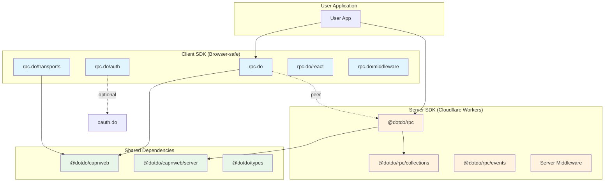

# Package Boundary: rpc.do vs @dotdo/rpc

This document formalizes the boundary between the two RPC packages in this repository.

## Package Overview



## rpc.do (Client SDK)

**Location:** `/src/` (root)
**npm:** `rpc.do`
**Purpose:** Browser-safe RPC client for calling Durable Objects

### What It Provides

| Export | Description |
|--------|-------------|
| `rpc.do` | Main entry: `RPC()` factory, proxy types, `$` default client |
| `rpc.do/transports` | Transport implementations: `http`, `capnweb`, `binding`, `composite` |
| `rpc.do/auth` | Auth providers: `oauthProvider`, `cachedAuth`, `staticAuth` |
| `rpc.do/react` | React hooks for RPC (useQuery, useMutation patterns) |
| `rpc.do/middleware` | Client middleware: `loggingMiddleware`, `timingMiddleware`, `retryMiddleware` |
| `rpc.do/errors` | Error classes: `ConnectionError`, `RPCError`, `AuthenticationError` |
| `rpc.do/server` | Server utilities: `createTarget`, `createHandler` (for exposing SDKs) |
| `rpc.do/expose` | WorkerEntrypoint wrapper for service bindings |

### Key Features

- **RPC Proxy**: Proxy-based API that turns `$.users.get('123')` into RPC calls
- **DO Client**: Remote access to DO internals (`$.sql`, `$.storage`, `$.collection`)
- **Transports**: HTTP, WebSocket/capnweb, Service Bindings
- **Authentication**: oauth.do integration, token caching
- **Client Middleware**: Request/response interception for logging, timing, retry
- **Type Safety**: `RpcProxy<T>`, `RpcResult<T>`, `RpcInput<T>` utilities

### Environment

- **Runs in:** Browser, Node.js, Cloudflare Workers (as client)
- **Bundle size:** ~3KB core proxy
- **No server dependencies:** Does not import `cloudflare:workers` or server-only modules

---

## @dotdo/rpc (Server SDK)

**Location:** `/core/`
**npm:** `@dotdo/rpc`
**Purpose:** Base class for RPC-enabled Durable Objects

### What It Provides

| Export | Description |
|--------|-------------|
| `@dotdo/rpc` | Main: `DurableRPC` class, `RpcContext`, `router()` |
| `@dotdo/rpc/collections` | Collections implementation for SQLite-backed document store |
| `@dotdo/rpc/events` | Events integration for DO event sourcing |
| `@dotdo/rpc/lite` | Minimal DurableRPC without collections |

### Key Features

- **DurableRPC Base Class**: Extends `DurableObject` with RPC capabilities
- **Direct Accessors**: `this.sql`, `this.storage`, `this.collection()` inside DO methods
- **WebSocket Hibernation**: capnweb protocol with Cloudflare's hibernation API
- **HTTP Batch RPC**: Efficient request bundling via capnweb
- **Schema Introspection**: `getSchema()` for typed client generation
- **Server Middleware**: `serverLoggingMiddleware`, `serverTimingMiddleware`
- **Worker Router**: `router()` for Worker -> DO routing
- **Colo Awareness**: Location helpers via colo.do integration

### Environment

- **Runs in:** Cloudflare Workers (Durable Objects only)
- **Requires:** `@cloudflare/workers-types`, Workers runtime
- **Dependencies:** `@dotdo/capnweb/server`, `@dotdo/collections`, `@dotdo/do`

---

## Dependency Relationship

```
rpc.do
  dependencies:
    @dotdo/capnweb (required - RPC protocol)
  peerDependencies:
    @dotdo/types (optional - enhanced type definitions)
    oauth.do (optional - authentication)
    glob (optional - CLI tooling)
    ts-morph (optional - type extraction)

@dotdo/rpc
  dependencies:
    @dotdo/capnweb (required - RPC protocol)
    @dotdo/collections (required - document store)
    @dotdo/do (required - DO utilities)
  peerDependencies:
    @cloudflare/workers-types (required - DO types)
    @dotdo/types (optional - enhanced types)
    @dotdo/events (optional - event sourcing)
    colo.do (optional - location awareness)
```

### Important Note

**rpc.do does NOT depend on @dotdo/rpc at runtime.** They communicate via the capnweb protocol. The relationship is:

1. `@dotdo/rpc` defines the server-side methods (e.g., `__sql`, `__storageGet`)
2. `rpc.do` calls these methods via transport (HTTP/WebSocket)
3. Both packages share the same internal method names via their respective `constants.ts`

---

## Shared vs Duplicated

### Currently Duplicated (Intentionally)

| Item | rpc.do Location | @dotdo/rpc Location | Reason |
|------|-----------------|---------------------|--------|
| `INTERNAL_METHODS` | `src/constants.ts` | `core/src/constants.ts` | Protocol constants must match; separate files avoid cross-dependency |
| Middleware Types | `RpcClientMiddleware` | `ServerMiddleware` | Different contexts (client vs server), different interfaces |
| Collection Types | `Filter`, `QueryOptions` | `Filter`, `QueryOptions` | Client needs types for query building; server has full implementation |
| Schema Types | `DatabaseSchema`, `RpcSchema` | Same types | Client needs for introspection response; server generates them |

### Should Remain Duplicated

1. **`constants.ts`** - Both packages need these for protocol compatibility, but importing one from the other would create an unwanted dependency. Keep them in sync manually or via a shared constants package.

2. **Middleware Interfaces** - Client middleware (`RpcClientMiddleware`) and server middleware (`ServerMiddleware`) have fundamentally different signatures:
   - Client: `onRequest(method, args)` - no context
   - Server: `onRequest(method, args, ctx)` - has `MiddlewareContext` with env, request

3. **Filter/QueryOptions** - Client needs these types to construct queries; server has the implementation. Duplication is acceptable as they're simple interfaces.

### Could Be Shared (Future Consideration)

1. **`@dotdo/rpc-protocol`** - A tiny package with:
   - `INTERNAL_METHODS` constants
   - Shared schema types (`DatabaseSchema`, `RpcSchema`, etc.)
   - SQL query serialization format

2. **Type Re-exports** - Some types from `@dotdo/types/rpc` are re-exported by both packages. Consider consolidating documentation about which package to import from.

---

## Communication Protocol

The packages communicate via the capnweb RPC protocol over HTTP POST or WebSocket.

### Internal Methods

Both packages define these internal method names for built-in DO features:

```typescript
// SQL
'__sql'           // Execute query, return all rows
'__sqlFirst'      // Execute query, return first row
'__sqlRun'        // Execute write operation

// Storage
'__storageGet', '__storageGetMultiple'
'__storagePut', '__storagePutMultiple'
'__storageDelete', '__storageDeleteMultiple'
'__storageList', '__storageKeys'

// Collections
'__collectionGet', '__collectionPut', '__collectionDelete'
'__collectionHas', '__collectionFind', '__collectionCount'
'__collectionList', '__collectionKeys', '__collectionClear'
'__collectionNames', '__collectionStats'

// Schema
'__dbSchema', '__schema'
```

### Client-Server Flow

```
Client (rpc.do)                           Server (@dotdo/rpc)
     |                                           |
     | $.sql`SELECT * FROM users`.all()          |
     |                                           |
     | --> transport.call('__sql', [{            |
     |       strings: ['SELECT * FROM users'],   |
     |       values: []                          |
     |     }])                                   |
     |                                           |
     |        [HTTP POST / WebSocket]            |
     | ----------------------------------------> |
     |                                           |
     |                                    DurableRPC.__sql()
     |                                    this.sql.exec(...)
     |                                           |
     | <---------------------------------------- |
     |        { results: [...], meta: {...} }    |
     |                                           |
```

---

## When to Use Which Package

| Scenario | Package |
|----------|---------|
| Building a browser app that calls DOs | `rpc.do` |
| Building a Node.js service that calls DOs | `rpc.do` |
| Building a Worker that calls other DOs | `rpc.do` |
| Building the Durable Object itself | `@dotdo/rpc` |
| Exposing an SDK as RPC endpoint | `rpc.do/server` or `rpc.do/expose` |
| Need React hooks for RPC | `rpc.do/react` |
| Need collections/SQL inside DO | `@dotdo/rpc` |

---

## Version Synchronization

Both packages follow semantic versioning independently but should maintain protocol compatibility:

- **Breaking protocol changes** require major version bumps in both packages
- **Internal method name changes** must be synchronized in both `constants.ts` files
- **Schema format changes** must be backward compatible or versioned

Current versions:
- `rpc.do`: 0.2.4
- `@dotdo/rpc`: 0.2.4

---

## Future Improvements

1. **Shared Protocol Package**: Extract `INTERNAL_METHODS` and schema types to `@dotdo/rpc-protocol`
2. **Type Generation**: Use `@dotdo/rpc` schema introspection to generate typed clients
3. **Protocol Versioning**: Add explicit version negotiation to capnweb handshake
4. **Middleware Unification**: Consider a shared middleware pattern with adapters for client/server
